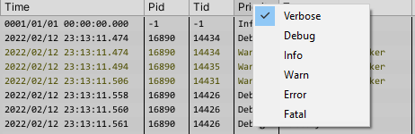
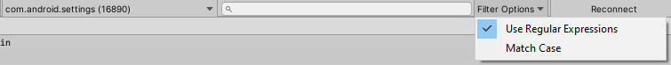

#### Filter

You can filter messages by the following characteristics:

- By **Priority**
    - You can right click on the **Priority** column to select or deselect priorities. Priorities are predefined according to the [Android Logcat Document](https://developer.android.com/studio/command-line/logcat#filteringOutput).

- By **Tag**
    - Right click on the **Tag** column to select or deselect tags. You can also add or remove a tag by following these steps:
        - Find a message with the tag you want to add.
        - Right click on the message and select **Add Tag** or **Remove Tag**.  

- You can also open the tag control window to manipulate tags by following steps:
    - Click the **Tag** column to show the menu.
    - Click **Tag Control** menu item to show the **Tag Control Window**.  

- By **Process Id**
    - Right click on the message and select **Filter by process id** 
[Filter By Process Id](images/FilterByProcessId.png)

- By **Text Filter**
    - You can text filter in the text field on the toolbar to filter logs by text. 
    - The text filter can be tread as regular expression.
    - The text filter can ignore character casing.
    - You can perform filtering while disconnected from the device
