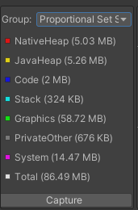
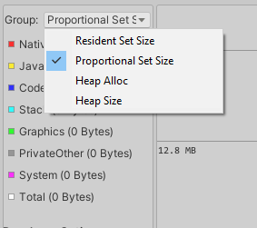
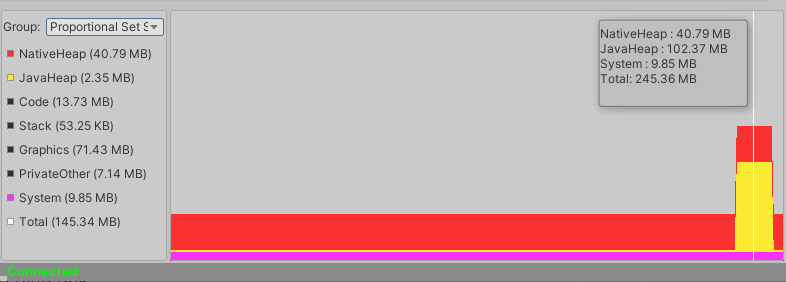

### Memory Window

**Memory Window** is available from Tools menu.

 

 

Memory window helps you track the total allocated memory of your application. By default, when you select a package, **Android Logcat** starts periodically requesting memory for your application.

You can change Memory Window behavior from the Tools->Memory Window.

* **Auto Capture**

  Periodically capture application memory when the package is selected.
* **Manual Capture**

  Manually capture application memory by clicking **Capture** button. This is useful if memory requests are affecting your application's performance.

  

* **Disabled**

  Disables Memory Window and memory requests for your application.

#### Memory Requests

Memory requests are done using **adb shell dumpsys meminfo package_name**. You can read more about it [here](https://developer.android.com/studio/command-line/dumpsys#meminfo).

Here's an example of memory dump:

#### Memory Groups

* **Proportional Set Size (PSS)**
 
  The total **used** memory of the application which is currently stored in RAM. This is not the **total** memory which your application has allocated.
  For example., If you allocate memory from native heap, but don't read or write to such memory (a.k.a make it dirty), it will not appear in PSS memory.

  **Note:** As mentioned in the google docs, if a memory page is shared between several processes, the size contribution of such page is proportional. 
  For example., if there's 20MB of Graphics memory is shared between two processes, you'll only see 10MB added application's PSS memory.

* **Heap Alloc**
  
 The total memory allocated using Dalvik and native heap allocators. This includes both memory which is in RAM or is paged in the storage.
 This is the best metric when checking out if your application is leaking Native or Java memory.
 
* **Heap Size**

 The total memory which is reserved by your application, this memory size will be always bigger than **Heap Alloc** size.

#### Controls

* You can disable/enable memory types by toggling in the left pane.

* You can select a memory request result by clicking in the right pane.