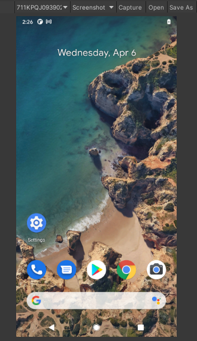
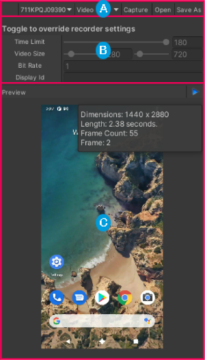

## Screen Capture

**Screen Capture** is available from Tools menu.

 

 

You can use the **Screen Capture** button on the toolbar to capture:

### Screenshot

* Select the android device
* Choose **Screenshot** from the toolbar
* Click **Capture**
  * Logcat package uses **screencap** process on the Android device for capturing screenshots
* The captured screenshot will be displayed
* Clicking **Open** will open the screenshot with the app associated with .png extension
* Clicking **Save As** will save the screenshot to the location of your choosing

### Video

* Select the android device
* Choose **Video** from the toolbar
* Click **Capture**
  * Logcat package uses **screenrecord** process on the Android device for capturing videos
* Click **Stop** to stop the recording
* The captured video will be displayed.
* Clicking **Open** will open the video with the app associated with .mp4 extension
* Clicking **Save As** will save the video to the location of your choosing

#### Overriding defaults

You can override the following settings for the **screenrecord** by toggling them:
* **Time Limit** - time limit in seconds, if not overriden - time limit is 180 seconds.
* **Video Size** - if not overriden, device's main display resolution will be used as video size
* **Bit Rate** - if not overriden, the default bit rate is 20000000 bits per second.
* **Display Id** - if not overriden, the default display used is the primary display, to get display ids, execute **adb shell dumpsys SurfaceFlinger --display-id** in the terminal. 

#### Known Issues
* **screenrecord** doesn't capture sound, only image is captured
* Logcat package uses Unity's video player for the video preview, you might see **WindowsVideoMedia** warnings in Editor console if your host OS is Windows, since displayed video is not processed
* If you're capturing a static image, the video will contain only one frame and be a zero length video
* **Chrome OS**: you can only capture the video from the sandboxed app, meaning which you install manually via adb or Unity. You cannot capture video from desktop or builtin apps.

