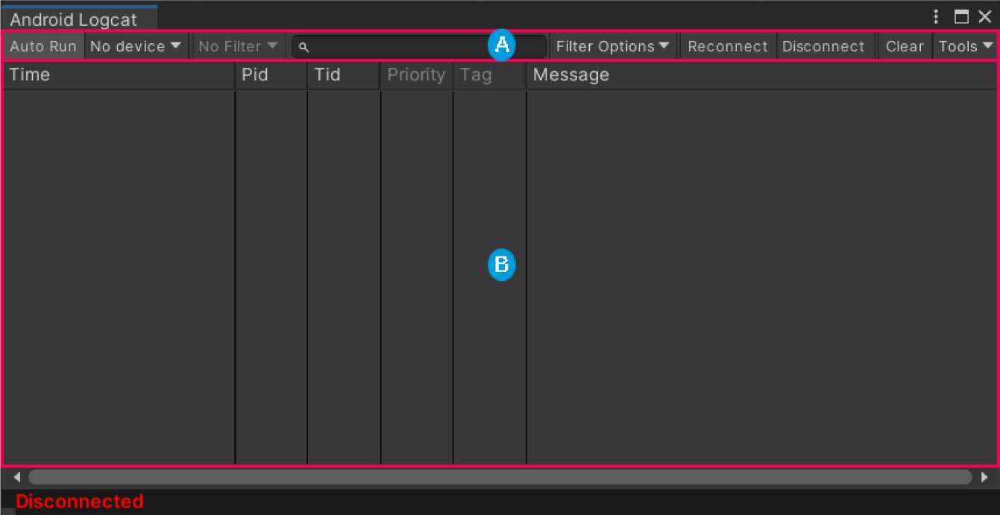
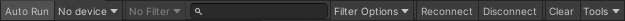
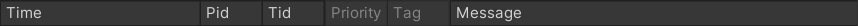

# Android Logcat window reference

This page introduces the different parts of the Android Logcat window's interface.

> The Anrdoid Logcat window.

| **Label**               | **Description**                                              |
| ----------------------- | ------------------------------------------------------------ |
|  | [Toolbar](#toolbar): Contains options and tools for the Android Logcat window. |
|  | [Message log](#message-log): Lists the messages that Unity receives from Android Logcat. |

## Toolbar

The toolbar contains options that customize the message log section and also additional tools that relate to Android Logcat and the connected Android device.

> The Android Logcat window toolbar.

| **Toolbar option**   | **Description**                                              |
| -------------------- | ------------------------------------------------------------ |
| **Auto Run**         | Toggles auto-run. When enabled, the Android Logcat window launches automatically when you [Build And Run](https://docs.unity3d.com/2022.2/Documentation/Manual/android-BuildProcess.html) your application. For more information, see [Use auto run](messages.md#use-auto-run). |
| **Device Selector**  | Specifies the Android device to connect the Android Logcat window to. For more information, see [Connect to a device](connect-to-a-device.md). |
| **Package Selector** | Specifies the application on the Android device to display messages for. For more information, see [Select an application](messages.md#select-an-application). |
| **Filter Input**     | A search field that you can use to filter the [message log](#message-log) by text. For more information, see [Filter the message logs](android-logcat-window-message-log-filter.md). |
| **Filter Options**   | Options that determine how to use **Filter Input** to filter messages in the message log. The options are: &#8226; **Use Regular Expressions**: Indicates whether to treat the **Filter Input** as a regular expression.  &#8226; **Match Case**: Indicates whether to make the filter case-senstive or not.   For more information, see [Filter the message logs](android-logcat-window-message-log-filter.md). |
| **Reconnect**        | Reconnects the Android Logcat window to the application and the device. If the application is no longer running, this reconnects to the device with no application selected. |
| **Disconnect**       | Disconnects the Android Logcat window from the device.       |
| **Clear**            | Clears the list of messages in the [message log](#message-log). |
| **Tools**            | A drop-down list of tools that can help you to debug your Android application. The options are: &#8226; **Screen Capture**: Captures screenshots and videos from the connected Android device. For more information, see [Screen capture tool](screen-capture.md). &#8226; **Open Terminal**: Opens the terminal on macOS and Linux, and opens the Windows Console on Windows. &#8226; **Stacktrace Utility**: Resolves custom stack traces. For more information, see [Stacktrace Utility](stacktrace-utility.md). &#8226; **Memory Window**: Tracks the memory allocated for your application. For more information, see [Memory window](memory-window.md). |

## Message log

The message log section displays the messages that Unity receives from Android Logcat. It displays information for each message in predefined columns.

> Message log column names.

| **Column name** | **Description**                                              |
| --------------- | ------------------------------------------------------------ |
| **Icon**        | The icon that indicates the message type. If you want to see icons, but they aren't visible, increase the font size of messages. To do this, go **Edit** > **Preferences** > **Android Logcat Settings**, and increase **Font Size** until the icons appear. |
| **Time**        | The time that the message was produced.                      |
| **Pid**         | The ID of the process that produced the message.             |
| **Tid**         | The ID of the thread that produced the message.              |
| **Priority**    | The message's priority. For more information about message priority, see [Filtering log output](https://developer.android.com/studio/command-line/logcat#filteringOutput). |
| **Tag**         | The tag associated with the message.                         |
| **Message**     | The message text.                                            |

### Message log controls

The message log contains functionality that helps you to navigate through and share messages.

| **Control**  | **Description**                                              |
| ------------ | ------------------------------------------------------------ |
| **Copy**     | To copy the selected logs to the clipboard, right-click the selected messages and select **Copy**. |
| **Save**     | To save the selected logs to a file on your computer, right-click the selected messages and select **Save**. |
| **Navigate** | To navigate through message logs using the keyboard, use the arrow keys. |

## Additional resources

* [Customize message log columns](android-logcat-window-message-log-customize.md)
* [Filter the message log](android-logcat-window-message-log-filter.md)