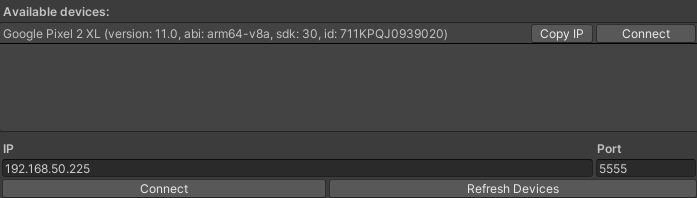
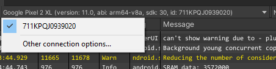

# Connect to a device

The Android Logcat package supports USB and wireless connection. This page explains how to connect an Android device to the [Android Logcat window](android-logcat-window.md).

## Connect a device

You can connect an Android device to the Android Logcat window either wirelessly or using a USB.

### Connect using a USB

For information on how to connect an Android device to Unity, see [USB debugging](https://docs.unity3d.com/2021.2/Documentation/Manual/android-debugging-on-an-android-device.html#usb-debugging). When you open the Android Logcat window, Unity automatically adds any USB-connected Android device to the device list.

### Connect wirelessly

To connect an Android device to the Android Logcat window:

1. Switch your Android device to TCP mode. For information on how to do this, see [Connect to a device over Wi-Fi](https://developer.android.com/studio/command-line/adb#wireless).
2. Open the [Android Logcat window](android-logcat-window.md).
3. From the [toolbar](android-logcat-window-reference.md#toolbar), select the **Device Selector**.
4. Select **Other connection options**.
5. In window that opens, enter the device's IP address and select **Connect**.

> The available devices window.

## Select a device

You can only connect to one device at a time. To select which device to connect to, use the device list in the Android Logcat window. This list contains the device IDs of connnected devices.

> The device list drop-down.

> [!TIP]
> If you connect multiple devices and can't tell which one is which from their device ID, select **Other connection options** in the device list. This opens a window that displays additional information for each connected device, including the name.

## Additional resources

* [Android Logcat window](android-logcat-window.md)
* [Messages](messages.md)