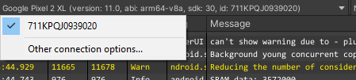

# **_Android Logcat Guide_**

## **Overview**

Android Logcat Package is a utility for displaying log messages coming from Android device in Unity Editor. Read more about [Android Logcat Document](https://developer.android.com/studio/command-line/logcat).

**Requirements**
- Compatible with Unity 2019.1 or above.
- Requires Unity's Android support module.
- Active platform in Unity has to be set to Android.

**Supported features**
- Device connnection
	- Via USB
	- Via Wifi
- Device selection
- Package selection
- Log 
	- Copy
	- Save
	- Clear
	- Filter by
		- Priority
		- Tag
        - Process Id
	- Search by
		- Text
		- Regex
- Auto run
- Screen capture
- Stacktrace resolving

## **Installing Android Logcat** 
To install Android Logcat package, follow the instructions in the [Package Manager documentation](https://docs.unity3d.com/Packages/com.unity.package-manager-ui@latest/index.html). 

You can access Android Logcat window in Unity Editor via
- Menu: **Window \> Analysis \> Android Logcat**
- Shortcut: **Alt+6** on Windows, **Option+6** on macOS.

## **Using Android Logcat**

The toolbar is on the top of the window. Most Android Logcat controls can be found here.  

### Device Connection
Connecting devices through USB and Wifi are both supported.

**Connect via USB**  
The devices connected through USB will be added to the device list automatically when starting Android logcat window. 

**Connect via Wifi**  
Before connecting, please follow the instructions in the [Android ADB Document](https://developer.android.com/studio/command-line/adb#wireless) to switch your device to TCP mode. 

Go to the devices list and click **\<Enter IP>** as below.  

And a window to enter an ip address will be popped up as below.  

**Device Selection**  
The device list contains all the connnected devices, but you can only select one device at a time from the list.

### Package Selection
The package selection list contains:
- Package of the top activity which is currently running on the selected device.
- Package from the player settings if it's running on the selected device (Doesn't have to be the the top running activity).

You can only select one package at a time, only the log messages come from the selected package will be shown in the logcat console window. Alternatively you can select **No Filter**, messages coming from all package will be shown.

### Log Controls

The log window contains multiple predefined columns, you can enable/disable them by right clicking on the columns.  

**Copy**  
The selected logs can be copied to the clipboard. You can right click on the messages and select **Copy**.

**Save**  
The selected logs can be saved to file. You can right click on the messages and select **Save Selection**.

**Clear**  
You can clear all the logs by click the **Clear** button on the toolbar.

**Search**  
You can input text in the text field on the toolbar to search logs by text. You can also toggle **Regex** on to treat contents in the text field as regex expression.

#### Filter
- By Priority  
  You can right click on the **Priority** column to select or deselect priorities. Priorities are predefined according to the [Android Logcat Document](https://developer.android.com/studio/command-line/logcat#filteringOutput).

- By Tag  
  Right click on the **Tag** column to select or deselect tags. You can also add or remove a tag by following steps:
  	1. Find a message with the tag you want to add.
	2. Right click on the message and select **Add Tag** or **Remove Tag**.  
	

  You can also open the tag control window to manipulate tags by following steps:
  	1. Click the **Tag** column to show the menu.
	2. Click **Tag Control** menu item to show the **Tag Control Window**.  
	!
- By Process Id
    1. Right click on the message and select **Filter by process id** 

### Screen Capture
You can use **Capture Screen** button on the toolbar to capture a screenshot of the selected device. You can also **Save** the screenshot as file.  

### Auto Run
When **Auto Run** is toggled, Android Logcat window will be launched automatically if you do **Build And Run** in **Build Settings** window.

### Stacktrace Utility
Allows you to copy paste custom log and resolve stacktrace.

Quick Steps:
- Copy paste a crash log from the application logcat.
- Set symbol path for specific **Configuration/Scripting Backend/CPU**
  - For ex., if crash log contains the following line:
    - **2019-05-17 12:00:58.823 30759-30803/? E/CRASH: Build type 'Release', Scripting Backend 'mono', CPU 'armeabi-v7a'"**
  - The build will be **Release/mono/armeabi-v7a**
  - The symbol path will be **Unity_Version/Editor/Data/PlaybackEngines/AndroidPlayer/Variations/mono/Release/Symbols/armeabi-v7a**
- (Optional)Adjust address resolving regex, the default regex is set to resolved addresses from following line:
  - **#00  pc 002983fc  /data/app/air.com.games2win.internationalfashionstylist-K3NlW-1enTfyTaSF59VaHA==/lib/arm/libunity.so**
  - You should adjust the regex if your addresses are printed in a different format
- Click Resolve Stacktraces

**Note: If you provide invalid symbol path, the function names will still be resolved, but they will not be correct. Android tools don't validate if specific address belongs to specific symbol file.**

### Stacktrace Resolving
One benefit of using Android Logcat package is automatic stacktrace resolving. The **addr2line** tool in Android NDK is used to convert the addresses in the crash logs to the file names and line numbers. Below is an example of what's added to log.

**_The original log from Android logcat_**

	E CRASH   :      #01  pc 01c65330  /data/app/com.CrashComp.Crash-J2Z_L0XSsSAZPkt9lab2rQ==/lib/arm/libunity.so(DiagnosticsUtils_Bindings::ForceCrash(DiagnosticsUtils_Bindings::ForcedCrashCategory, ScriptingExceptionPtr*)+48)

**_The log shown in Android Logcat window in Unity Editor_**

	Error CRASH: 	#01  pc 01c65330  /data/app/com.CrashComp.Crash-J2Z_L0XSsSAZPkt9lab2rQ==/lib/arm/libunity.so DiagnosticsUtils_Bindings::ForceCrash(DiagnosticsUtils_Bindings::ForcedCrashCategory, ScriptingExceptionPtr*) at ../Runtime/Export/Diagnostics/DiagnosticsUtils.bindings.cpp:25

To use this feature, you need to 
- Have Android NDK installed and set the NDK path in Unity (Menu: **Editor** \> **Preferences...** \> **External Tools**).
- Have the corresponding symbol files installed with Unity.

## **Document Revision History**
|Date|Reason|
|---|---|
|Apr 01, 2019|Document Updated. Matches package version 0.2.5.|
|Jan 22, 2019|Document Updated. Matches package version 0.2.1.|
|Nov 16, 2018|Document Updated. Matches package version 0.1.3.|
|Oct 30, 2018|Document Updated. Matches package version 0.1.2.|
|Oct 23, 2018|Document created. Matches package version 0.1.1.|