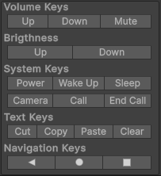
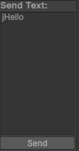

# Inputs window

To open the Inputs window in the Unity Editor:

1. Open the [Android Logcat window](android-logcat-window.md).
2. In the [Toolbar](android-logcat-window-reference.md#toolbar), select **Tools** > **Window** > **Inputs**.

The inputs window is divided into five sections:
* Keyboard keys
* Cursor keys
* Numpad keys
* Miscellaneous keys
* TV keys
* Send text window

**Note:** The key events which are affected by shift modifier are sent using - adb shell input keyevent <key_code> command.

**Note:** The key events which are not affected by shift modifier are sent using - adb shell input text <text> command.

## Keyboard keys

Includes letter, number, punctuation, symbol, function, and control keys.

#### Modifiers

You can select **Shift** modifier to send keys as if while holding shift.

## Cursor keys

Includes navigation keys.

## Numpad keys

Includes numerical keys.

## Miscellaneous keys

Includes various helper keys for Android:
* Volume keys
* Brightness keys
* System keys:
   * Power
   * Wake Up
   * Camera
   * Call
   * End Call
   * Cut/Copy/Paste
   * Back/Home/Menu

## TV keys

Incluse basic TV keys.

## Send text

 

 Provides functionality for send block of text to Android device.