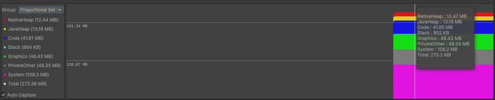

# Memory window reference

This page introduces the [Memory window's](memory-window-reference.md) interface. The interface for the Memory window is part of the [Android Logcat window](android-logcat-window.md).

To open the Memory window in the Unity Editor:

1. Open the [Android Logcat window](android-logcat-window.md).
2. In the [Toolbar](android-logcat-window-reference.md#toolbar), select **Tools** > **Memory Window** then either **Auto Capture** or **Manual Capture**.

If you select **Auto Capture**, Unity periodically captures memory snapshots for the selected application. If you select **Manual Capture**, the memory window provides a **Capture** button which you can use to manually capture a memory snapshot. This is useful if the automatic memory requests affect the application's performance.

> The memory window.

| **Label**               | **Description**                                              |
| ----------------------- | ------------------------------------------------------------ |
|  | [Memory details panel](#memory-details-panel): Displays the amount of allocated memory for each memory type. |
|  | [Memory chart](#memory-chart): Contains a chart of the memory allocated for the connected application over time. |

## Memory details panel

The memory details panel displays the amount of memory for each memory type. It can display different memory groups and, if you open the Memory window in **Manual Capture** mode, trigger a manual memory snapshot capture.

> The memory details panel.

| **Property**         | **Description**                                              |
| -------------------- | ------------------------------------------------------------ |
| **Group**            | Specifies the memory group to display memory allocation for. For more information, see [Memory groups](#memory-groups). |
| **Allocated Memory** | Lists types of memory and the amount of memory allocated to each type. |
| **Capture**          | Manually captures a snapshot of the memory allocated to your application. For information on how the Memory window captures the snapshot, see [Memory requests](#memory-requests). |

### Memory groups

The Memory window can display different memory groups allocated for your application.

| **Memory group**                | **Description**                                              |
| ------------------------------- | ------------------------------------------------------------ |
| **Resident Set Size (RSS)**     | The total amount of memory in RAM that the application allocated. This includes both shared and non-shared memory pages. For example, applications that access the same library share memory pages.  **Note**: This metric is only visible on Android 11 or higher. |
| **Proportional Set Size (PSS)** | The total amount of memory in RAM that the application actively uses. This is not the total memory that the application allocates. For example, if the application allocates memory from the native heap but doesn't read from or write to the memory, the memory doesn't appear in PSS memory.  Note: If several processes share a memory page, the size contribution of the page to PSS memory is proportional to the amount of memory and number of processes that share it. For example, if two processes share 20MB of graphics memory, the application's PSS memory only shows 10MB. |
| **Heap Alloc**                  | The total amount of memory the application allocates using Dalvik (Java allocators) and native heap allocators. This includes both memory which is in RAM or is paged in storage. This is the best metric when checking if the application is leaking Native or Java memory. |
| **Heap Size**                   | The total memory that the application reserves. This memory size will be always bigger than **Heap Alloc**. |

### Memory types

Depending on how you allocate memory in your application, Android creates memory of different types.

* If you allocate memory using the native functions **malloc** and **new**, or use C# **Marshal.AllocHGlobal**, this memory appears in the **Heap Alloc** and **Heap Size** groups under the **Native Heap** memory type.
* If you allocate memory using java functions like **new**, this memory appears in the **Heap Alloc** and **Heap Size** groups under the **Java Heap** memory type.
* In both cases above, both native and java memory won't appear in the **PSS** memory group until you try to write to or read from the allocated native or java memory.
* If you allocate memory using the C# **new** function, this memory appears in the **PSS** group under the **Private Other** memory type.

For more information, see [meminfo](https://developer.android.com/studio/command-line/dumpsys#meminfo).

To toggle which memory types appear in the [memory chart](#memory-chart), click the memory type in the [memory details panel](#memory-details-panel). 

### Memory requests

To make memory requests, the Memory window uses `adb shell dumpsys meminfo package_name`. For more information, see [dumpsys](https://developer.android.com/studio/command-line/dumpsys#meminfo).

The following screenshot shows the memory dump that `dumpsys` produces:

> A raw `dumpsys` memory dump.

## Memory chart

The memory chart displays the memory allocated for the connected application over time.

 
> The memory chart.

To view a snapshot in the [memory details panel](#memory-details-panel), click on the chart at the part you want to view.
