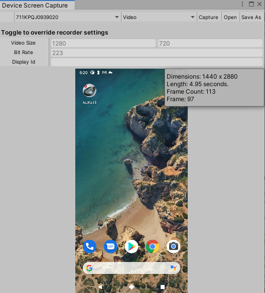
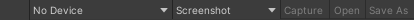

# Device Screen Capture window reference

This page introduces the Device Screen Capture window's interface.

To open the Device Screen Capture window:

1. Open the [Android Logcat window](android-logcat-window.md).
2. From the [toolbar](android-logcat-window-reference.md#toolbar), select **Tools** > **Screen Capture**.

> The Device Screen Capture window.

| **Label**               | **Description**                                              |
| ----------------------- | ------------------------------------------------------------ |
|  | [Toolbar](#toolbar): Contains options for the Device Screen Capture window. |
|  | [Recorder settings](#recorder-settings): Contains settings for video recording. |
|  | [Capture preview](#capture-preview): A preview of the screenshot or video captured from the device. |

## Toolbar

The toolbar contains options to control the Screen Capture tool.

> The Device Screen Capture window toolbar.

| **Toolbar option**      | **Description**                                              |
| ----------------------- | ------------------------------------------------------------ |
| **Device Selector**     | Specifies the Android device to capture the screen of.       |
| **Screen Capture Mode** | Specifies the screen capture mode to use. The options are:  &#8226; **Screenshot**: Switches the Screen Capture tool to screenshot mode. When you click **Capture**, the Screen Capture tool takes a screenshot and displays it in the [Capture preview](#capture-preview).  &#8226; **Video**: Switches the Screen Capture tool to video mode. When you click **Capture**, the Screen Capture tool begins capturing a video of the selected device. When you click **Stop**, the Screen capture tool finishes capturing the video and displays it in the [Capture preview](#capture-preview). |
| **Capture**             | If **Screen Capture Mode** is **Screenshot**, this captures a screenshot from the Android device. If **Screen Capture Mode** is **Video**, this begins video recording. |
| **Stop**                | Stops video recording. This option only appears while the Screen Capture tool is recording a video. |
| **Open**                | Opens the screen capture using the application associate with the file extension. The file extension is `.png` for screenshots and `.mp4` for videos. |
| **Save As**             | Saves the screen capture as a file on your computer.         |

## Recorder settings

Contains settings for video recording. The Screen Capture tool contains default values for each setting. To override the default value for a setting, toggle the setting and enter your own value.

> [!NOTE]
> This section only appears if you set **Screen Capture Mode** to **Video**.

| **Property**   | **Description**                                              |
| -------------- | ------------------------------------------------------------ |
| **Time Limit** | The time limit of the screen video recording in seconds. The default value is 180 seconds. |
| **Video Size** | The width and height of the video recording. The default value is the Android device's main display resolution. |
| **Bit Rate**   | The bit rate of the video recording. The default bit rate is 20000000 bits per second. |
| **Display Id** | The ID of the display being recorded. The default display ID is the primary display. To get display ids, execute `adb shell dumpsys SurfaceFlinger --display-id` in the terminal. |

## Capture preview

After you capture a screenshot or video, this section of the window displays the screenshot or video captured from the device. You can use this to check the quality of the screen capture before you save it as a file on your computer.

## Additional resources

* [Capture a screenshot](screen-capture-screenshot.md)
* [Capture a video](screen-capture-video.md)