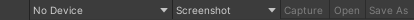

# Device Screen Capture window reference

This page introduces the Device Screen Capture window's interface.

To open the Device Screen Capture window, from the main menu in Unity select **Window** > **Analysis** > **Android Screen Capture**.

You can also open it from the Android Logcat window:

1. Open the [Android Logcat window](android-logcat-window.md).
2. From the [toolbar](android-logcat-window-reference.md#toolbar), select **Tools** > **Screen Capture**.

The window is split into two: a list of captures on the left, and whatever the list has selected on the right.

| **Area**                                | **Description**                                              |
| --------------------------------------- | ------------------------------------------------------------ |
| [Toolbar](#toolbar)                     | Contains options for the Device Screen Capture window.       |
| [Capture list](#capture-list)           | The live view and every screenshot you have taken. Drag the divider to resize it. |
| [Recorder settings](#recorder-settings) | Contains settings for video recording.                       |
| [Capture preview](#capture-preview)     | The screenshot, video or live view that the list has selected. |
| [Live view details](#live-view-details) | Information about the live stream, and the device navigation buttons. |

## Toolbar

The toolbar contains options to control the Screen Capture tool.

> The Device Screen Capture window toolbar.

| **Toolbar option**      | **Description**                                              |
| ----------------------- | ------------------------------------------------------------ |
| **Device Selector**     | Specifies the Android device to capture the screen of.       |
| **Screen Capture Mode** | Specifies the screen capture mode to use. The options are:  &#8226; **Screenshot**: Switches the Screen Capture tool to screenshot mode. When you click **Capture**, the Screen Capture tool takes a screenshot and displays it in the [Capture preview](#capture-preview).  &#8226; **Video**: Switches the Screen Capture tool to video mode. When you click **Capture**, the Screen Capture tool begins capturing a video of the selected device. When you click **Stop**, the Screen capture tool finishes capturing the video and displays it in the [Capture preview](#capture-preview). |
| **Capture**             | If **Screen Capture Mode** is **Screenshot**, this captures a screenshot from the Android device. If **Screen Capture Mode** is **Video**, this begins video recording. Ctrl+Shift+S (Cmd+Shift+S on macOS) captures a screenshot while this window has focus. |
| **Stop**                | Stops video recording. This option only appears while the Screen Capture tool is recording a video. |
| **Open**                | Opens the screen capture using the application associate with the file extension. The file extension is `.png` for screenshots and `.mp4` for videos. |
| **Save As**             | Saves the screen capture as a file on your computer.         |

## Capture list

The list on the left of the window holds the live view and every screenshot you have taken, from every device. Select a row to show it in the [Capture preview](#capture-preview), or use the Up and Down arrow keys to move through the list. Drag the divider between the list and the preview to resize the list.

| **Row**            | **Description**                                              |
| ------------------ | ------------------------------------------------------------ |
| **Live**           | The first row. Select it to view the selected device's screen live. Refer to [View the device screen live](screen-capture-live-stream.md). |
| A screenshot       | Named after its file, without the `.png` extension. Screenshots are saved automatically when you capture them, so every capture stays until you delete it. |

Screenshots are stored in your project, in `Library/AndroidLogcat/Screenshots`, and are named `<device id>_<number>.png`. They are not part of your build, and deleting the `Library` folder deletes them with it.

To work with a screenshot in the list:

| **Action**                           | **Result**                                              |
| ------------------------------------ | ------------------------------------------------------- |
| Double-click a row                   | Opens the image in the application associated with `.png`. |
| Click the **×** at the end of a row  | Deletes the screenshot from disk, after asking you to confirm. The Delete key (Cmd+Backspace on macOS) does the same to the selected row. |
| Right-click a row                    | Opens a menu with **Show In Explorer** (**Show In Finder** on macOS), **Open**, **Save As** and **Rename**. |
| Press F2 (Enter on macOS)            | Renames the selected screenshot. Enter confirms the new name and Escape cancels. |

> [!NOTE]
> Renaming a screenshot to something other than `<device id>_<number>` keeps it in the list, but it no longer counts towards that device's numbering.

## Recorder settings

Contains settings for video recording. The Screen Capture tool contains default values for each setting. To override the default value for a setting, toggle the setting and enter your own value.

> [!NOTE]
> This section only appears if you set **Screen Capture Mode** to **Video**.

| **Property**   | **Description**                                              |
| -------------- | ------------------------------------------------------------ |
| **Time Limit** | The time limit of the screen video recording in seconds. The default value is 180 seconds. |
| **Video Size** | The width and height of the video recording. The default value is the Android device's main display resolution. |
| **Bit Rate**   | The bit rate of the video recording. The default bit rate is 20000000 bits per second. |
| **Display Id** | The ID of the display being recorded. The default display ID is the primary display. To get display ids, execute `adb shell dumpsys SurfaceFlinger --display-id` in the terminal. |

## Capture preview

This section of the window displays whatever the [Capture list](#capture-list) has selected: a screenshot, a recorded video, or the live view of the device's screen. You can use this to check the quality of the screen capture before you save it as a file on your computer.

### Zoom into the image

A screenshot and the live view are both fitted to the window, which can be too small to read a log line or see a single pixel. To look closer:

| **Action**                                             | **Result**                                                   |
| ------------------------------------------------------ | ------------------------------------------------------------ |
| Ctrl+Wheel (Cmd+Wheel on macOS) over the image          | Zooms between 100% and 1000%, around the pointer, so whatever you point at stays where it is. The current zoom appears in the corner of the image while it is above 100%. |
| Ctrl+Middle mouse button drag (Cmd on macOS)            | Moves the zoomed image, to bring another part of it into view. |
| The scrollbars                                          | The same, and they appear as soon as the image is larger than the space for it. |

Zooming and moving the image only change how you see it. In the live view, the device still receives your clicks, drags and keys at the place on its screen you are pointing at, and the wheel on its own still scrolls the device rather than the view.

The zoom of the live view and the zoom of the screenshots are separate, and both go back to 100% when scripts recompile.

## Live view details

This section appears to the right of the image while the **Live** row is selected.

| **Property**    | **Description**                                              |
| --------------- | ------------------------------------------------------------ |
| **Stream size** | The size of the streamed image. This is the device display scaled down to fit the **Max Size** setting, not the device's own resolution. |
| **Frame rate**  | How many frames per second are arriving. The device only sends a frame when its screen changes, so a device showing a still screen sends almost none. |
| **Bandwidth**   | How much data per second is arriving from the device.        |
| **Input**       | Whether the device accepts the touch, scroll and key events this window sends it. Devices that refuse input injection still stream. |

Below the properties are the device navigation buttons, which work while the live view is streaming and the device accepts input:

| **Button** | **Description**                                              |
| ---------- | ------------------------------------------------------------ |
| **◄**      | Sends the Back key. The Escape key does the same once you click the image. |
| **●**      | Sends the Home key.                                          |
| **■**      | Sends the Overview (recent apps) key.                        |

For how to interact with the device and how to change the size, quality and frame rate of the stream, refer to [View the device screen live](screen-capture-live-stream.md).

## Additional resources

* [Capture a screenshot](screen-capture-screenshot.md)
* [Capture a video](screen-capture-video.md)
* [View the device screen live](screen-capture-live-stream.md)
* [Android Logcat Settings](android-logcat-settings.md#live-stream)
