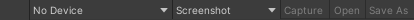

# Device Screen Capture window reference

This page introduces the Device Screen Capture window's interface.

To open the Device Screen Capture window, from the main menu in Unity select **Window** > **Analysis** > **Android Screen Capture**.

You can also open it from the Android Logcat window:

1. Open the [Android Logcat window](android-logcat-window.md).
2. From the [toolbar](android-logcat-window-reference.md#toolbar), select **Tools** > **Screen Capture**.

The window is split into two: a list of captures on the left, and whatever the list has selected on the right.

| **Area**                                | **Description**                                              |
| --------------------------------------- | ------------------------------------------------------------ |
| [Toolbar](#toolbar)                     | Contains options for the Device Screen Capture window.       |
| [Capture list](#capture-list)           | The live view and every screenshot you have taken. Drag the divider to resize it. |
| [Capture preview](#capture-preview)     | The screenshot, video or live view that the list has selected. |
| [Capture details](#capture-details) | Information about the selected screenshot or recording.            |
| [Live view details](#live-view-details) | Information about the live stream, and the device navigation buttons. |
| [Status bar](#status-bar)               | Where the last screenshot or video was saved.                |

## Toolbar

The toolbar contains options to control the Screen Capture tool.

> The Device Screen Capture window toolbar.

| **Toolbar option**      | **Description**                                              |
| ----------------------- | ------------------------------------------------------------ |
| **Device Selector**     | Specifies the Android device to capture the screen of.       |
| **Advanced**           | Opens a menu with **Preferences**, which is where the capture settings live. |

## Capture list

The left of the window holds the **Live** button and, under it, every capture you have taken, from every device. Select **Live** to mirror the device's screen, or select a capture to show it in the [Capture preview](#capture-preview). The Up and Down arrow keys move through the captures. Drag the divider between the list and the preview to resize the list.

Select more than one capture to act on several at once: Shift and click extends the selection, Ctrl and click (Cmd on macOS) adds or removes one, and Ctrl+A (Cmd+A) selects all of them. Press Delete, or right-click and select **Delete**, to remove every selected capture in one step - which is how you clear the list.

| **Item**           | **Description**                                              |
| ------------------ | ------------------------------------------------------------ |
| **Live**           | The button above the list. Select it to view the selected device's screen live, and to take screenshots. Refer to [View the device screen live](screen-capture-live-stream.md). |
| A capture          | A screenshot or a recording, named after its file without its extension, with an icon for which it is. Captures are saved as you take them, so every one stays until you delete it. Selecting a recording plays it in the [Capture preview](#capture-preview). |

Screenshots are stored in your project, in the folder set by [Captures Folder](android-logcat-settings.md#capture-settings), and are named `<device id>_<number>.png`. The default folder is not part of your build, and deleting the `Library` folder deletes them with it.

To work with the captures in the list:

| **Action**                                | **Result**                                              |
| ----------------------------------------- | ------------------------------------------------------- |
| Click a row                               | Selects that capture and shows it in the [Capture preview](#capture-preview). |
| Shift-click a row                         | Extends the selection from the last one you clicked. |
| Ctrl-click a row (Cmd-click on macOS)     | Adds a capture to the selection, or removes it. |
| Press Ctrl+A (Cmd+A on macOS)             | Selects every capture. |
| Double-click a row                        | Opens the capture in the application associated with its file type. |
| Press Delete (Cmd+Backspace on macOS)     | Deletes every selected capture from disk, after asking you to confirm. |
| Right-click a row                         | Opens a menu with **Show In Explorer** (**Show In Finder** on macOS), **Open**, **Copy To...**, **Rename**, **Delete** and **Select All**. **Show In Explorer**, **Open** and **Rename** act on the row you clicked and are unavailable while several captures are selected. **Copy To...** and **Delete** act on the whole selection: copying one capture asks for a name, copying several asks for a folder to put them in. |
| Press F2 (Enter on macOS)                 | Renames the selected capture. Enter confirms the new name and Escape cancels. |

To empty the list, select every capture with Ctrl+A (Cmd+A on macOS) and press Delete.

> [!NOTE]
> Renaming a screenshot to something other than `<device id>_<number>` keeps it in the list, but it no longer counts towards that device's numbering.

## Capture preview

This section of the window displays whatever the [Capture list](#capture-list) has selected: a screenshot, a recorded video, or the live view of the device's screen. You can use this to check the quality of the screen capture before you save it as a file on your computer.

### Zoom into the image

A screenshot and the live view are both fitted to the window, which can be too small to read a log line or see a single pixel. To look closer:

| **Action**                                             | **Result**                                                   |
| ------------------------------------------------------ | ------------------------------------------------------------ |
| Ctrl+Wheel (Cmd+Wheel on macOS) over the image          | Zooms between 100% and 4000%, around the pointer, so whatever you point at stays where it is. The current zoom appears in the corner of the image while it is above 100%. |
| Ctrl+Left or middle mouse button drag (Cmd on macOS)    | Moves the zoomed image, to bring another part of it into view. |
| The scrollbars                                          | The same, and they appear as soon as the image is larger than the space for it. |

Zooming and moving the image only change how you see it. In the live view, the device still receives your clicks, drags and keys at the place on its screen you are pointing at, and the wheel on its own still scrolls the device rather than the view.

The zoom of the live view and the zoom of the screenshots are separate, and both go back to 100% when scripts recompile.

## Capture details

This section appears to the right of the image while a screenshot or a recording is selected.

| **Property**       | **Description**                                              |
| ------------------ | ------------------------------------------------------------ |
| **Device**         | The device the capture was taken from. Hover over it for the device id. |
| **OS**             | The Android version and API level the device was running.    |
| **Display Size**   | The device's display resolution when the capture was taken. This differs from **Image Size** if the display was rotated or its size overridden. |
| **Image Size**     | The size of the image in pixels. Screenshots only.           |
| **Video Size**     | The size of the recording in pixels, which is what the **Video Size** setting asked for. Recordings only. |
| **Length**         | How long the recording runs. Recordings only.                |
| **File Size**      | The size of the file on disk.                                |
| **Captured**       | When the file was last written. Hover over it for the full date and time. |

**Device**, **OS** and **Display Size** come from the details file saved next to the capture, so they read `Undefined` for a capture taken before this package wrote one, or for a file added to the folder by hand. **Video Size** and **Length** come from the recording itself, so they read `Undefined` until it has opened.

A selected recording starts playing and loops. **Play** and **Pause**, below the properties, stop and resume it.

## Live view details

This section appears to the right of the image while the **Live** row is selected.

| **Property**    | **Description**                                              |
| --------------- | ------------------------------------------------------------ |
| **Display Size** | The resolution of the display being mirrored. Compare it with **Stream Size** to see how much the stream is scaling down. It follows the device, so it changes when the device is rotated or a foldable is opened. |
| **Stream Size** | The size of the streamed image. This is the device display scaled down to fit the **Max Size** setting, not the device's own resolution. |
| **Frame Rate**  | How many frames per second are arriving. The device only sends a frame when its screen changes, so a device showing a still screen sends almost none. |
| **Bandwidth**   | How much data per second is arriving from the device.        |
| **Input**       | Whether the device accepts the touch, scroll and key events this window sends it. Devices that refuse input injection still stream. |

Below the properties are the device navigation buttons, which work while the live view is streaming and the device accepts input:

| **Button** | **Description**                                              |
| ---------- | ------------------------------------------------------------ |
| **◄**      | Sends the Back key. The Escape key does the same once you click the image. |
| **●**      | Sends the Home key.                                          |
| **■**      | Sends the Overview (recent apps) key.                        |

Below them, **Device Rotation** turns the device's screen:

| **Button**  | **Description**                                              |
| ----------- | ------------------------------------------------------------ |
| **Auto**    | Hands the rotation back to the device's accelerometer.       |
| **0°**      | Locks the device to its natural orientation.                 |
| **90°**     | Locks the device rotated 90°.                                |
| **180°**    | Locks the device rotated 180°.                               |
| **270°**    | Locks the device rotated 270°.                               |

On a foldable, **Device Fold** follows: **Fold**, **Unfold**, and **Half** on a device that reports half open as a state of its own, hold the device that way whatever its hinge is doing - which is how the other display is reached without touching the device. **Auto** hands it back to the hinge. The row does not appear for a device that does not fold.

**Device Capture**, at the bottom, holds the two ways of keeping what is on the device. **Take Screenshot** captures the screen and adds it to the [Capture list](#capture-list); Ctrl+Shift+S (Cmd+Shift+S on macOS) does the same while this window has focus. **Take Recording** starts recording the device's screen and becomes **Stop Recording**; the recording is added to the list when it stops. Leaving the live view stops it too, by selecting a capture or closing the window, so a recording never carries on out of sight. Both are taken on the device rather than copied from the stream, so they are full resolution whatever the stream is scaled down to, and the recorder's settings are in [Preferences](android-logcat-settings.md#capture-settings).

For how to interact with the device and how to change the size, quality and frame rate of the stream, refer to [View the device screen live](screen-capture-live-stream.md).

## Status bar

The bar along the bottom of the window reports what the window last did:

* Where a capture was written, for example `Screenshot saved to Library/AndroidLogcat/Screenshots/<device id>_1.png`. A path inside your project is shown relative to it.
* What the live view is streaming, once its first frame arrives, for example `Live stream: Google Pixel 7 Pro (36081FDH3002Q8), 1080x2340 scaled to 232x512, up to 15 fps`. It is reported again when the streamed size changes, which happens when the device is rotated or a foldable is opened, and `Live stream stopped` when it ends.

Every capture is kept until you delete it, screenshots and recordings alike, in the folder set by [Captures Folder](android-logcat-settings.md#capture-settings).

## Additional resources

* [Capture a screenshot](screen-capture-screenshot.md)
* [Capture a video](screen-capture-video.md)
* [View the device screen live](screen-capture-live-stream.md)
* [Android Logcat Settings](android-logcat-settings.md#live-stream)
