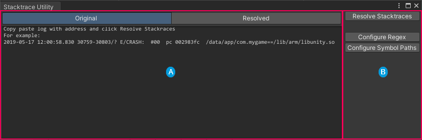

# Stacktrace Utility window reference

This page introduces the Stacktrace Utility window interface.

To open the Stacktrace Utility window:

1. Open the [Android Logcat window](android-logcat-window.md).
2. From the [toolbar](android-logcat-window-reference.md#toolbar), select **Tools** > **Stacktrace Utility**.

> The Stacktrace Utility window.

| **Label**               | **Description**                                              |
| ----------------------- | ------------------------------------------------------------ |
|  | [Stacktrace display](#stacktrace-display): Contains a text area to enter a custom stacktrace, and a text area to display the resolved stacktrace. |
|  | [Stacktrace Utility controls](#stacktrace-utility-controls): Contains controls for the Stacktrace Utility window. |

## Stacktrace display

The stacktrace display contains two tabs:

* **Original**: A text area that you can copy stacktraces into for the Stacktrace Utility tool to resolve.
* **Resolved**: A text area that the Stacktrace Utility tool populates with the resolved stracktrace you entered into the **Original** tab.

## Stacktrace Utility controls

The Stacktrace Utility controls section contains buttons that help you to set up the Stacktrace Utility tool, and also resolve stacktraces.

| **Button**                  | **Description**                                              |
| --------------------------- | ------------------------------------------------------------ |
| **Resolve**                 | Resolves the stacktrace currently in the **Original** text area of the [stacktrace display](#stacktrace-display) then displays the resolved stacktrace in the **Resolved** text area. |
| **Configure Regex**         | Opens the Android Logcat Settings section of the [Preferences window](https://docs.unity3d.com/Manual/Preferences.html). For more information, see [Set up Stacktrace Utility](stacktrace-utility-set-up.md). |
| **Configure Symbols Paths** | Opens the Android Logcat Settings section of the [Project Settings window](https://docs.unity3d.com/Manual/comp-ManagerGroup.html). For more information, see [Set up Stacktrace Utility](stacktrace-utility-set-up.md). |

## Additional resources

* [Set up Stacktrace Utility](stacktrace-utility-set-up.md)
* [Resolve a stacktrace](stacktrace-utility-resolve.md)